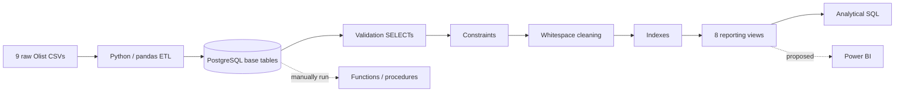

# Ecommerce Sales Analytics

## Executive summary

This portfolio project loads the nine Olist Brazilian Ecommerce CSVs into PostgreSQL, validates and cleans them, applies constraints and indexes, exposes reporting views, and provides reusable SQL analytics. Python provides a locally run, destructive batch pipeline; PostgreSQL contains the analytical model. Power BI is a planned consumer, but no report artifact is present.

## Business objective

The project supports analysis of order activity, product-price revenue, customers, sellers, categories, payments, delivery performance, and RFM-style behavior. It provides engineers and analysts with a reproducible relational foundation and reviewed SQL patterns for BI.

## Architecture and flow



The actual pipeline order is reset schema → create tables → load CSVs → validation → constraints → cleaning → indexes → views. Validation does not enforce pass/fail thresholds. Functions, procedures, and analytical query files are outside `etl/pipeline.py`.

## Technology and dataset

- PostgreSQL, Python, pandas, SQLAlchemy, psycopg2, python-dotenv
- Olist Brazilian Ecommerce public CSV dataset in `data/raw/`
- Mermaid plus Draw.io/PNG ERD assets
- Power BI directory present as a placeholder

Verified source/live row counts are in [data_model.md](docs/data_model.md). Purchases span 2016-09-04 through 2018-10-17.

## Repository map

| Path | Contents |
|---|---|
| `data/raw/` | Nine source CSVs (approximately 120 MB) |
| `data/processed/` | Placeholder; SQL procedures create database tables instead |
| `etl/` | Pipeline, connection, loader, and ordered SQL runners |
| `sql/00_setup`–`sql/10_documentation` | Database assets and analytical SQL |
| `docs/` | Canonical documentation, ERDs, profiling, and historical notes |
| `powerbi/` | Placeholder; no report/model artifact |

## Run locally

> **Destructive:** the pipeline drops `public` with `CASCADE`. Use a dedicated database. Current code also prints credentials; avoid shared logs until fixed.

```bash
python -m venv .venv
source .venv/bin/activate
pip install -r requirements.txt
cp .env.example .env
# edit .env, then:
python -m etl.pipeline
```

PostgreSQL must be reachable and the configured database must already exist: the pipeline calls reset before its create-if-absent setup step. The role must be able to reset `public` and create objects. See [runbook.md](docs/runbook.md).

## Model, quality, and analytics

`orders` is the order-grain hub; `order_items` is the order-item bridge between orders, products, and sellers. Payments and reviews are separate children. Geolocation is not physically joined because ZIP prefixes are non-unique. See [data model](docs/data_model.md), [dictionary](docs/data_dictionary.md), and [ERD](docs/diagrams/erd.md).

Implemented SQL covers exploration, aggregates, joins, subqueries, CTEs, windows, business questions, advanced analysis, and one interview solution. Metric formulas and query caveats are in [metrics.md](docs/metrics.md) and [analytics.md](docs/analytics.md).

The load preserves source exceptions. Revenue in implemented analytics is `SUM(order_items.price)` and excludes freight; payment value is separate. Details: [validation](docs/validation.md), [constraints](docs/constraints.md), [quality](docs/data_quality.md), [assumptions](docs/assumptions.md), [limitations](docs/limitations.md), [views](docs/views.md), [indexes](docs/indexes.md), [functions](docs/functions.md), and [procedures](docs/procedures.md).

## Power BI

No `.pbix` or `.pbit` exists. The views are plausible source objects, but their mixed grains require a deliberate model. See the clearly proposed [Power BI design](docs/powerbi.md).

## Project status

| Status | Scope |
|---|---|
| Completed | Raw files, nine-table schema, CSV loader, profiling SQL, conservative cleaning, constraints, indexes, eight views, broad SQL analysis, ERD assets |
| Partially completed | Observational validation; one interview solution; six functions/three procedures defined but not orchestrated; only two functions live-deployed; recorded SQL/documentation defects |
| Not implemented | Power BI report, automated assertions/tests, CI/CD, scheduling, incremental loads, production secrets/logging, populated file-based processed layer |

## Key audit findings

- The repository can answer revenue, customer, seller, category, delivery, monthly trend, repeat-customer, and RFM questions.
- One business-query alias error and one slow correlated subquery were observed; see [analytics.md](docs/analytics.md).
- Business result values are not presented because no approved, versioned results export exists.

## Next enhancements

First make the pipeline safe and deterministic: remove credential logging, add validation assertions, provide a non-destructive/reload mode, and orchestrate function/procedure deployment. Then fix the recorded SQL defects, add integration tests, and build the proposed Power BI model.

Start with the [documentation index](docs/README.md).
