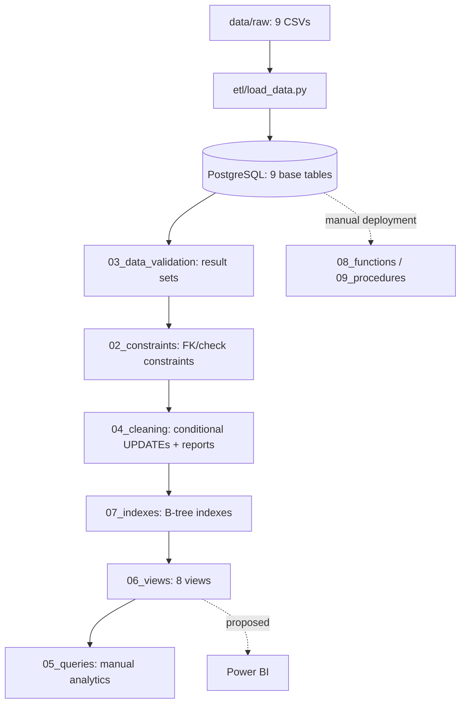

# Architecture

## Implemented flow

| Layer | Actual responsibility |
|---|---|
| Source | Versioned raw Olist CSVs; no API/source database |
| Python | Loads `.env`, creates engines, resets/creates schema, appends CSVs, executes sorted SQL folders |
| PostgreSQL | Source-aligned tables, constraints, indexes, views, optional reusable logic |
| Quality | SELECT-based profiling plus conservative whitespace updates; no quarantine |
| Consumption | Manual SQL today; Power BI proposed, not built |

There is no Airflow, dbt, Docker, cloud deployment, scheduler, CI/CD, or production orchestration.

## Boundaries and drift

- `sql/00_setup/create_database.sql` is unused; Python creates `DB_NAME` through `postgres`.
- The pipeline omits `sql/05_queries`, `08_functions`, `09_procedures`, and `10_documentation`.
- `data/processed/` is not the procedure target; the procedure creates a PostgreSQL table.
- ERDs are design artifacts. The drawn product-category FK is not physically enforced, review PK is composite in SQL, and geolocation links are conceptual only.

This is a local full-refresh portfolio pipeline, not an incremental or fault-tolerant production service.
