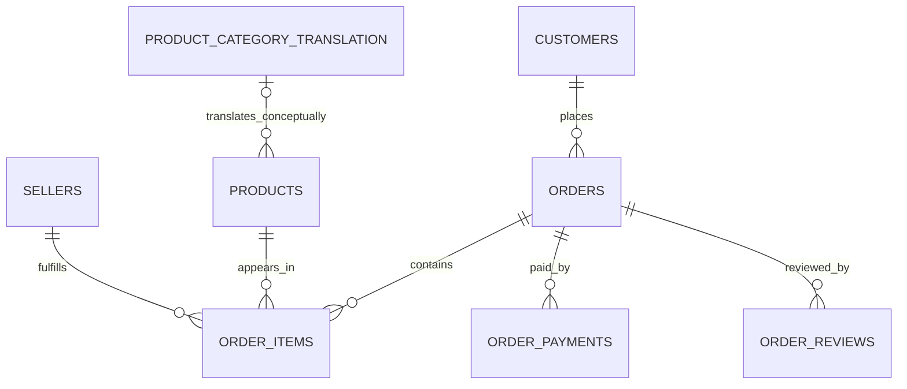

# Data model

## Conceptual relationships

`order_items` is bridge-like: it resolves the many-to-many business relationship between orders and products while also recording the fulfilling seller and item-level price/freight. Geolocation joins to customer/seller ZIP prefixes are conceptual only and can multiply rows because a prefix repeats.

## Physical tables

Counts were verified in both raw CSVs and the configured live database on 2026-08-21.

| Table | Purpose and grain | PK | Important FKs | Rows |
|---|---|---|---|---:|
| `customers` | One order-specific customer record | `customer_id` | — | 99,441 |
| `orders` | One order | `order_id` | `customer_id → customers` | 99,441 |
| `order_items` | One numbered line/item in an order | (`order_id`,`order_item_id`) | order, product, seller | 112,650 |
| `order_payments` | One payment sequence for an order | (`order_id`,`payment_sequential`) | order | 103,886 |
| `order_reviews` | One source review/order pair | (`review_id`,`order_id`) | order | 99,224 |
| `products` | One product | `product_id` | category FK intentionally absent | 32,951 |
| `sellers` | One seller | `seller_id` | — | 3,095 |
| `product_category_translation` | One Portuguese-to-English category mapping | `product_category_name` | — | 71 |
| `geolocation` | One source coordinate observation for a ZIP prefix | none | none | 1,000,163 |

## Cardinality caveats

- `customer_id` identifies an order-associated customer record; `customer_unique_id` is the cross-order customer identity (96,096 values in the source).
- Reviews are not physically one-to-zero/one per order: 551 repeated `order_id` values exist. `review_id` alone also repeats 814 times; the composite is unique.
- Category translation is a left-join lookup, not an enforced parent: two non-null source categories lack mappings and 610 products have null category.
- Geolocation has 261,831 fully duplicated rows and non-unique ZIP prefixes. Direct joins require deduplication/aggregation first.

The Draw.io/PNG diagrams in `docs/diagrams/` are useful conceptual artifacts but show stale physical details noted above.
